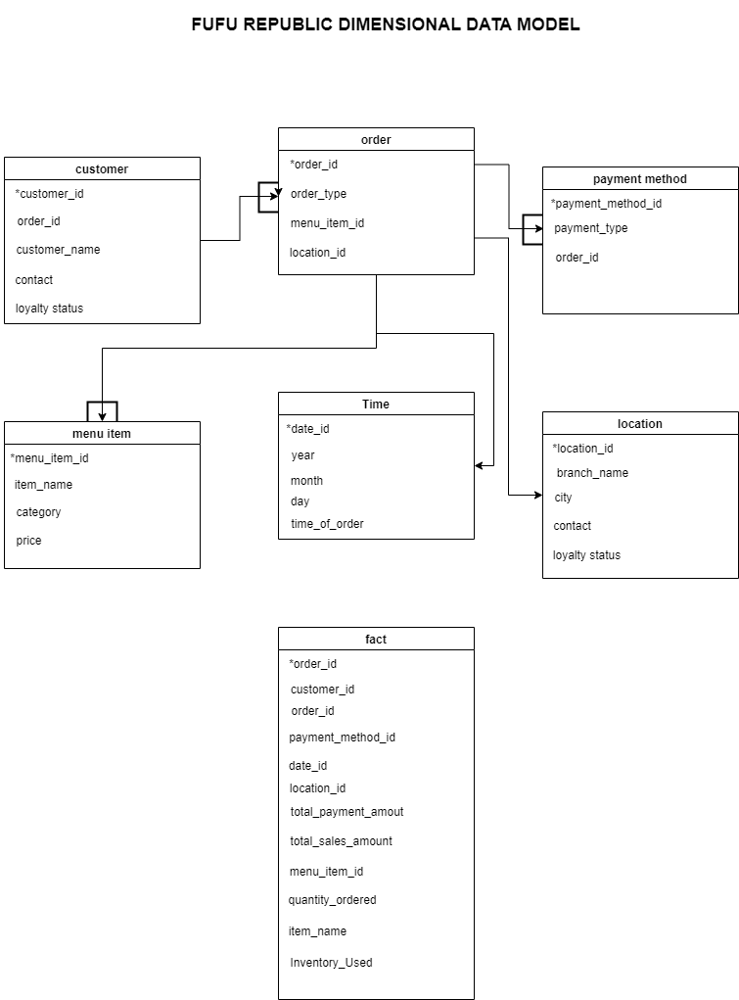

# FUFU REPUBLIC DIMENSIONAL DATA MODEL

### 1. Mapping Out the Necessary Entities, Relationships, and Constraints

#### Key Entities:

- Customers: Representing the individuals ordering food.
- Orders: Transactions that track purchases made by customers.
- Menu Items: The food and drink options available at each branch.
- Locations (Branches): Outlets where Fufu Republic operates.
- Payments: How customers pay (cash, debit card, online).
- Inventory: Stock levels of ingredients or menu items at each location
  
#### Relationships:

- Each customer can make multiple orders.
- Each order contains one or more menu items.
- Each order is placed at a specific location (branch).
- Each payment is tied to an order and can have various payment methods.
  
#### Constraints:

- Menu items must exist before they can be ordered.
- Payments must match an order's total value.
- Inventory should align with customer demand per location to prevent stock shortages or excess.
  
### 2. Creating a Dimensional Model

#### Business Process:

- Sales Tracking and Stock Management

#### Business Questions:

- What are the total sales by branch, payment method, and dining option (dine-in, take-out, online)?
- How can we predict demand for specific menu items to manage stock levels efficiently?
- Which customers are likely to respond to personalized promotions based on past purchases?
  
#### Identify Grain, Dimensions, and Facts:

1. Grain: The grain of the fact table is one row per order at a specific location, with payment and dining details.

Example: "One order placed at Lekki branch for dine-in using a debit card."

2. Dimensions: These describe the context of the business process.

- Customer Dimension: Info about the customer (name, contact, loyalty status).
- Location Dimension: Branch info (branch name, city).
- Menu Item Dimension: Details about the food (item name, category, price).
- Time Dimension: Date and time details (year, month, day, time of order).
- Payment Method Dimension: Info about payment types (cash, debit, online).
- Order Type Dimension: Whether it’s dine-in, take-out, or online.
  
3. Fact Table: The core of the model stores numeric values (measures).

Order Fact Table:

- Total sales amount (sum of item prices in the order).
- Quantity of each item ordered.
- Total payment amount for each order.
- Inventory used for each order (for stock management).
  
#### Dimensional Model Structure:

Fact Table:

- Order_ID (Primary Key)
- Customer_ID (Foreign Key from Customer Dimension)
- Menu_Item_ID (Foreign Key from Menu Item Dimension)
- Location_ID (Foreign Key from Location Dimension)
- Payment_Method_ID (Foreign Key from Payment Method Dimension)
- Order_Type_ID (Foreign Key from Order Type Dimension)
- Date_ID (Foreign Key from Time Dimension)
- Total_Sales_Amount
- Total_Payment_Amount
- Quantity_Ordered
- Inventory_Used
  
Dimensions:

- Customer Dimension: Customer_ID, Name, Contact, Loyalty_Status
- Location Dimension: Location_ID, Branch_Name, City
- Menu Item Dimension: Menu_Item_ID, Item_Name, Category, Price
- Payment Method Dimension: Payment_Method_ID, Method_Type (e.g., cash, card, online)
- Order Type Dimension: Order_Type_ID, Type (e.g., dine-in, take-out, online)
- Time Dimension: Date_ID, Year, Month, Day, Time
